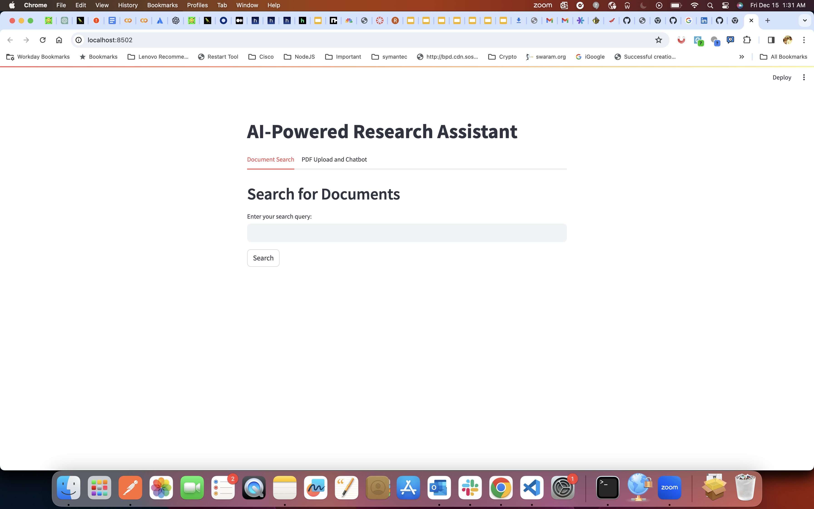

# AI Research Assistant

## Purpose
Enhance academic research efficiency.

## Core Features

- **Article Search**: 
  - Utilizes ArXiv dataset metadata from Kaggle.
  - Advanced search capabilities powered by embeddings stored in Pinecone index.

- **PDF Summarization & Chat**: 
  - Offers PDF upload for quick summarization.
  - Interactive chat feature for user engagement and clarification.

## Benefits

- Facilitates quick access to relevant academic articles.
- Simplifies the comprehension of complex scholarly material.

## Target Users

Researchers, students, and academics.

## Architecture 


(images/Arch_1.png)
(images/Arch_2.png)

## Instructions to run the code

Once you download the code to server and setup virtual environment, please run the followig commads

```python
  pip install -r requirements.txt
  streamlit run main.py
```

## Demo Screenshots



